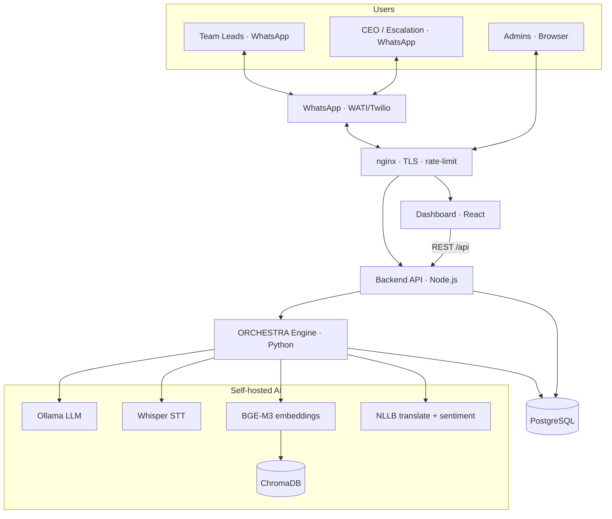

# مدير · Mudir — AI Project Coordinator for WhatsApp

Mudir ("Manager" in Arabic) is a B2B AI project coordinator that lives **inside
WhatsApp**. It coordinates multi-team projects such as retail store openings:
teams (Property → Marketing → IT) complete sequential tasks while the bot tracks
progress, sends reminders, escalates delays, and confirms the store opens on time.

> Built for Saudi retail chains. All bot replies are **bilingual** — Arabic first,
> English fallback — and the schedule respects the Saudi working week (Sun–Thu).

---

## 🧭 Answers to the pre-build design questions

1. **Backend — Node.js or Python?** → **Node.js / Express** was chosen (the file
   layout in the brief used `.js`, and the Twilio + Supabase + OpenAI SDKs are
   first-class in Node). All backend code is in [`backend/`](backend/).
2. **Twilio sandbox or production?** → Start on the **Twilio WhatsApp Sandbox**
   for development (`TWILIO_WHATSAPP_FROM=whatsapp:+14155238886`), then switch to
   an approved production sender. Outbound business-initiated messages use the
   Meta-approved templates in [`WHATSAPP_TEMPLATES.md`](WHATSAPP_TEMPLATES.md).
3. **How many teams per store opening?** → Default **3** (Property, Marketing,
   IT), configurable via `DEFAULT_TEAM_COUNT` and per-project `metadata.workflow`
   (e.g. add Logistics). The state machine adapts to any workflow length.
4. **What if a team lead leaves the WhatsApp group?** → Notifications are sent to
   the team lead's stored WhatsApp number (from the `team_leads` table), **not**
   to group membership, so leaving the group does not break routing. Update the
   number on the Settings page; if a lead is unreachable, overdue tasks
   auto-escalate to the team's `escalation_number` (CEO).
5. **DMs or group chats?** → Both work. The bot responds to whatever number
   messages it (group or 1:1). Commands are keyed off the sender's team lead
   record, so a lead can drive their tasks from a DM or the group.

---

## ✨ Features

- 📱 **Lives inside WhatsApp** — team leads coordinate entirely from chat (group or DM)
- 🧠 **Learns workflows dynamically** — the AI infers project stages from a conversation; works for **any industry** (retail, software, events, construction…)
- 🎙️ **Voice notes** — Arabic/English speech transcribed on-device (Whisper) and mapped to actions
- 🖼️ **Image & document intake** — OCR turns permits/receipts into structured updates
- 🔀 **Stateful orchestration** — a dependency-aware state machine advances stages, detects blockers and computes progress
- ⏰ **Delay prediction & auto-escalation** — delays ≥ 3 days escalate to the CEO automatically
- 🌍 **Bilingual, Arabic-first** — every reply is Arabic first with an English fallback
- 🇸🇦 **Saudi-aware scheduling** — respects the Sun–Thu working week (Friday skip)
- 🔒 **100% self-hosted** — Ollama + Whisper + BGE-M3 + ChromaDB + NLLB; **no OpenAI, no per-message API cost**, your data stays on your server
- 📊 **Admin dashboard** — React 18 + Vite + Tailwind, RTL, dark mode, analytics
- 🚀 **Production-ready** — Docker Compose (GPU/CPU), nginx TLS, monitoring, backups, CI/CD

---

## 🏗️ Architecture



More diagrams (data flow + sequence diagrams) live in
[`docs/architecture.mermaid`](docs/architecture.mermaid).

```
backend/                 Node.js/Express service (webhook + REST API + cron)
├── src/
│   ├── index.js         App entrypoint (Express, rate limiting, cron)
│   ├── webhook.js       Twilio WhatsApp webhook (signature verified) + router
│   ├── commands.js      /new_project /assign /complete /extend /status /escalate
│   ├── state-machine.js property → marketing → it → ready → completed
│   ├── database.js      Supabase data-access layer (repository interface)
│   ├── notifications.js Outbound WhatsApp via Twilio (retry/backoff)
│   ├── ai-service.js    OpenAI summaries + Whisper voice transcription
│   ├── voice-handler.js Voice note → intent → confirm → execute
│   ├── cron-jobs.js     09:00 daily summary; hourly overdue escalation; Fri skip
│   ├── templates.js     Bilingual (AR/EN) message copy
│   ├── api.js           JSON REST API for the dashboard
│   ├── config.js        Central env config (fail-fast in production)
│   └── logger.js        Structured logging (pino), secrets redacted
├── migrations/          SQL: 0001_init.sql (schema), 0002_seed.sql (demo data)
└── tests/               Jest: state machine, utils, e2e flow, voice, cron, load

frontend/                React + Vite + Tailwind admin dashboard (see frontend/README.md)
├── src/pages/           Dashboard, Projects, ProjectDetail, Workflows, Teams,
│                        Analytics, Settings, WhatsAppSettings, Login
├── src/components/      Reusable UI (ProjectCard, StatusBadge, ProgressBar,
│                        StageTimeline, Sidebar, Header, Chart, Modal, Toast, …)
├── src/hooks/           Data + state hooks (React Query, realtime, auth, toasts)
├── src/api/             Supabase client + data modules (REST fallback)
├── src/context/         Global state (App, Auth, Theme — dark mode + RTL)
└── src/utils/           Helpers (date, status, validators, export, colors, formatting)
```

### State machine

```
property_pending → marketing_pending → it_pending → ready → completed
```

When a team runs `/complete`, the engine: (1) marks their tasks done,
(2) computes the next state, (3) persists it, (4) writes an audit log, and
(5) notifies the next team lead (or broadcasts readiness to everyone).

---

## 🚀 Getting started

### Prerequisites
- Node.js ≥ 18
- A Supabase project, a Twilio WhatsApp sender, and an OpenAI API key

### Backend
```bash
cd backend
cp .env.example .env          # fill in TWILIO_*, SUPABASE_*, OPENAI_*
npm install
# Apply the schema in the Supabase SQL editor:
#   migrations/0001_init.sql  then  migrations/0002_seed.sql
npm test                      # run the test suite
npm run dev                   # start on http://localhost:3000
```

Point your Twilio WhatsApp webhook at `POST https://<public-url>/webhook`
(use ngrok locally: `ngrok http 3000`, then set `PUBLIC_URL`).

### Frontend
```bash
cd frontend
cp .env.example .env          # add VITE_SUPABASE_* (optional: demo mode works without)
npm install
npm run dev                   # http://localhost:5173 (proxies /api → backend)
npm run build                 # production build
npm test                      # Vitest unit + component tests
```

The dashboard is Arabic-first (RTL) with a light/dark theme and an in-app
Arabic ⇄ English toggle. It uses Supabase for auth + real-time updates, React
Query for data fetching and Chart.js for charts. See
[`frontend/README.md`](frontend/README.md) for full details.

---

## 💬 WhatsApp commands

| Command | Description |
| --- | --- |
| `/new_project [name]` | Create a project and start the first team's turn |
| `/assign [team] [task] [deadline]` | Assign a task (deadline `YYYY-MM-DD`) |
| `/complete [project_id]` | Complete the current team's tasks and advance |
| `/extend [project_id] [team] [days]` | Extend a team's deadlines; alert the CEO |
| `/status [project_id]` | Full project timeline report |
| `/escalate [project_id] [reason]` | Urgent alert to the escalation contact |
| `/help` | List commands |

Voice notes are transcribed (Whisper); phrases like "we're done / خلصنا" are
mapped to `/complete` and **confirmed** before executing.

---

## 🧪 Testing

The Python engine has a comprehensive pytest suite (unit + integration + e2e)
that mocks every external service (Ollama, Whisper, the ML models and the
WhatsApp API), so it runs anywhere with no GPU, models or network.

```bash
pip install -r requirements-test.txt

pytest                              # run the whole suite
pytest --cov=orchestra --cov-report=html   # with coverage
pytest tests/unit/test_state_machine.py     # a single file
pytest -m e2e                       # only end-to-end workflow tests
```

Database integration tests are skipped unless a real PostgreSQL is available:

```bash
export ORCHESTRA_TEST_DATABASE_URL="postgresql+asyncpg://<user>:<pass>@<host>:5432/orchestra_test"
pytest tests/integration/test_database.py
```

CI runs the suite on every PR across Python 3.10 / 3.11 / 3.12 with a PostgreSQL
service container — see [`.github/workflows/test.yml`](.github/workflows/test.yml).
The Node backend and React frontend keep their own suites (`npm test`).

---

## 📚 Documentation

| Guide | Audience |
| --- | --- |
| [USER_GUIDE.md](USER_GUIDE.md) · [العربية](docs/ar/USER_GUIDE.ar.md) | Team leads using the WhatsApp bot |
| [ADMIN_GUIDE.md](ADMIN_GUIDE.md) | Company admins configuring teams & workflows |
| [DEPLOYMENT.md](DEPLOYMENT.md) · [العربية](docs/ar/DEPLOYMENT.ar.md) | Operators deploying the stack |
| [API_REFERENCE.md](API_REFERENCE.md) | Integrators using the REST API & webhooks |
| [DEVELOPER_GUIDE.md](DEVELOPER_GUIDE.md) | Contributors extending the code |
| [docs/security.md](docs/security.md) | Security model, PDPL/GDPR compliance |
| [docs/performance.md](docs/performance.md) | Benchmarks, scaling & tuning |
| [CHANGELOG.md](CHANGELOG.md) | Release notes |
| [.github/CONTRIBUTING.md](.github/CONTRIBUTING.md) | How to contribute |
| [العربية · README](docs/ar/README.ar.md) | Arabic project overview |

---

## 🛡️ Production hardening included
- Twilio webhook **signature verification** (`X-Twilio-Signature`)
- **Rate limiting** on the public webhook
- **Retry with exponential backoff** for Twilio/OpenAI calls
- Structured **logging** with secret redaction
- **Fail-fast** config validation in production
- Non-root Docker image + healthcheck

## ⚠️ Known limitations / next steps
- Voice-note confirmations are stored in-memory; back with Redis for multi-instance.
- Project code allocation is sequential; add a DB sequence for high-concurrency creation.
- The dashboard REST API ships without auth — place it behind Supabase Auth / a gateway.

---

## 🚢 Deployment
- **Self-hosted production stack:** see [`DEPLOYMENT.md`](DEPLOYMENT.md) — full
  Docker Compose stack (Ollama, Whisper, ChromaDB, PostgreSQL, backend, frontend,
  nginx) with GPU/CPU profiles, monitoring, TLS and operational scripts.
  ```bash
  cp .env.production .env      # fill in secrets
  ./scripts/deploy.sh gpu      # or: ./scripts/deploy.sh cpu
  ./scripts/monitor.sh         # health snapshot
  ```
- **Render.com:** connect the repo — [`render.yaml`](render.yaml) is a blueprint
- **Railway.app:** `./deploy.sh railway` (uses [`railway.json`](railway.json))

Set all secret env vars in the platform dashboard or a local `.env`
(never commit `.env`).

---

## 🎨 App design prompts
Prompts for generating the visual assets (logo, chat mockups, dashboard, Gantt
timeline, mobile concept, interaction flow) live in
[`docs/VISUAL_PROMPTS.md`](docs/VISUAL_PROMPTS.md). Paste them into DALL·E,
Midjourney, or Stable Diffusion.

---

## 🤝 Contributing

Contributions are welcome! Please read
[`.github/CONTRIBUTING.md`](.github/CONTRIBUTING.md) for the workflow, coding
standards and PR process, and the [DEVELOPER_GUIDE.md](DEVELOPER_GUIDE.md) for
architecture details. Bug reports and feature requests use the
[issue templates](.github/ISSUE_TEMPLATE).

## 📄 License

Released under the [MIT License](LICENSE).
