# 📸 Mudir — Application Screenshots

Real screenshots of the Mudir admin dashboard (React + Vite + Tailwind),
captured at 1440×900 (2× DPI). The UI is Arabic-first (RTL) with a bilingual
Arabic ⇄ English toggle and a light/dark theme.

> These images were rendered from the running app populated with representative
> sample data.

## Sign in

| Arabic (RTL) | English (LTR) |
| --- | --- |
| 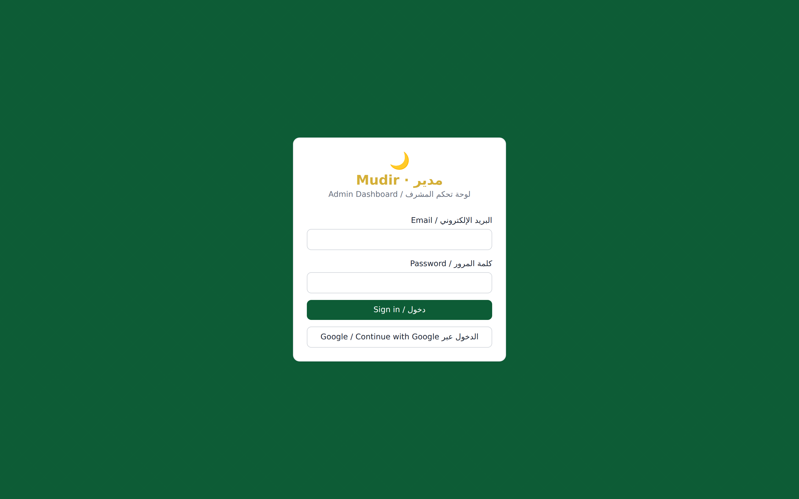 | 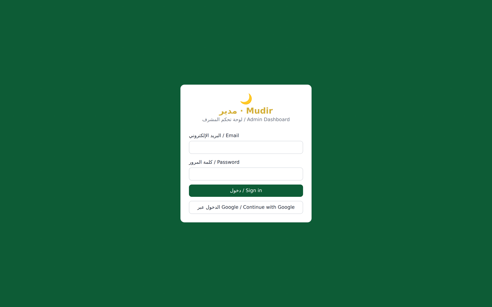 |

## Dashboard

Overview with stat cards, AI insights, a weekly projects chart, team workload
heatmap and recent activity.

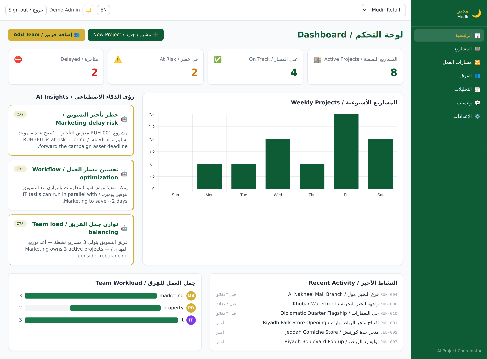

| Dark mode | English (LTR) |
| --- | --- |
| 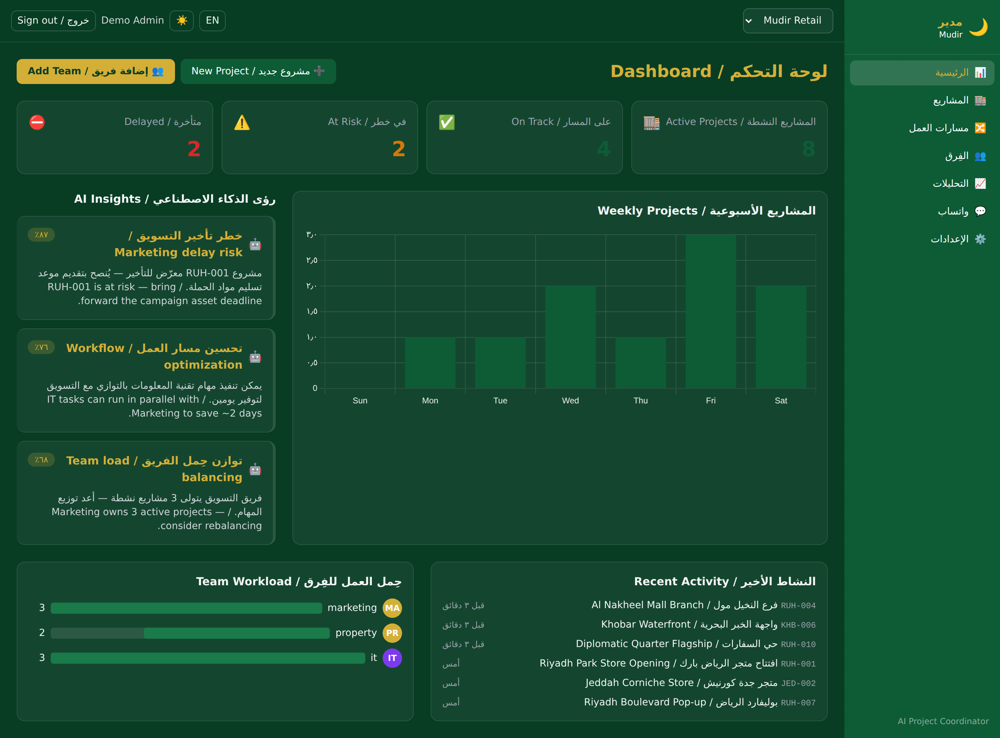 | 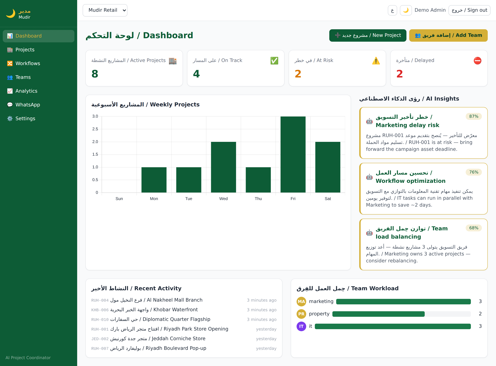 |

## Projects

Searchable, filterable project grid with status badges, progress bars and
pagination.

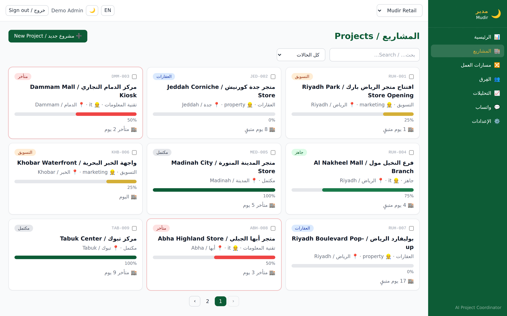

## Project detail

Stage timeline, per-stage task counts, task list, communication log, escalation
history and AI recommendations.

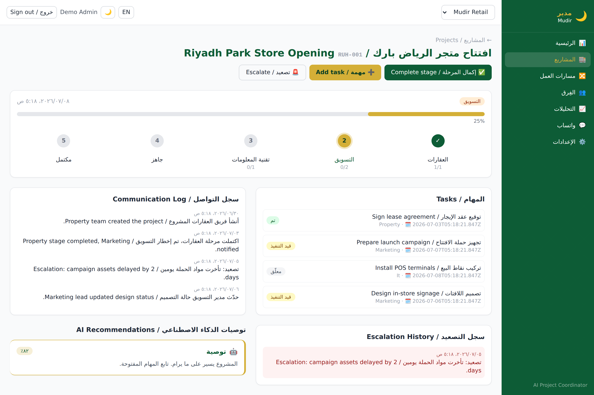

## Workflows

Workflow builder with drag-and-drop stages, AI-discovered workflow suggestions
and the list of existing workflows.

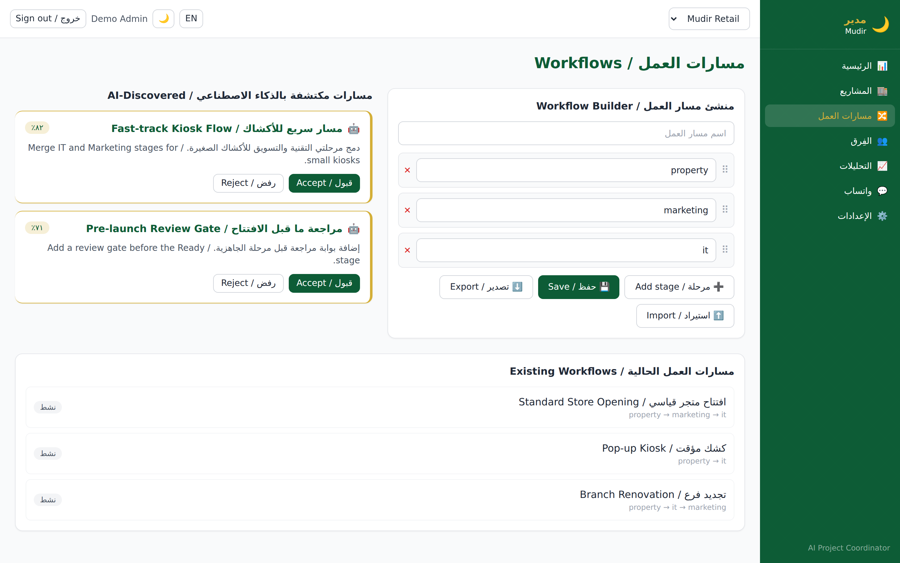

## Teams

Team cards showing the team lead, WhatsApp/escalation numbers, workload,
skills and performance.

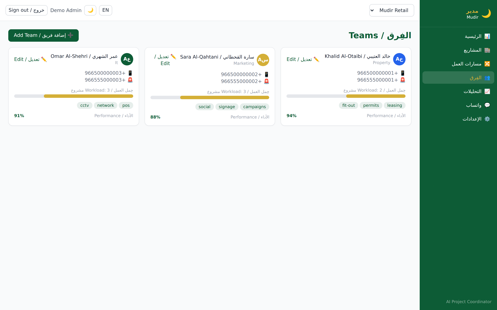

## Analytics

Completion-rate doughnut, team-performance and escalation bar charts, and AI
learning progress.

| Light | Dark |
| --- | --- |
| 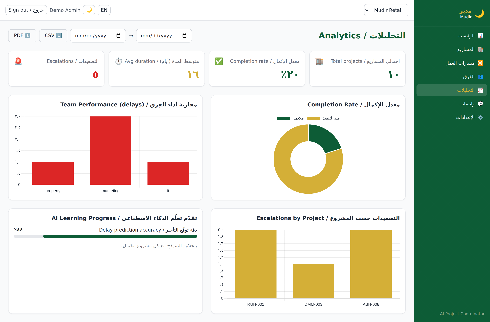 | 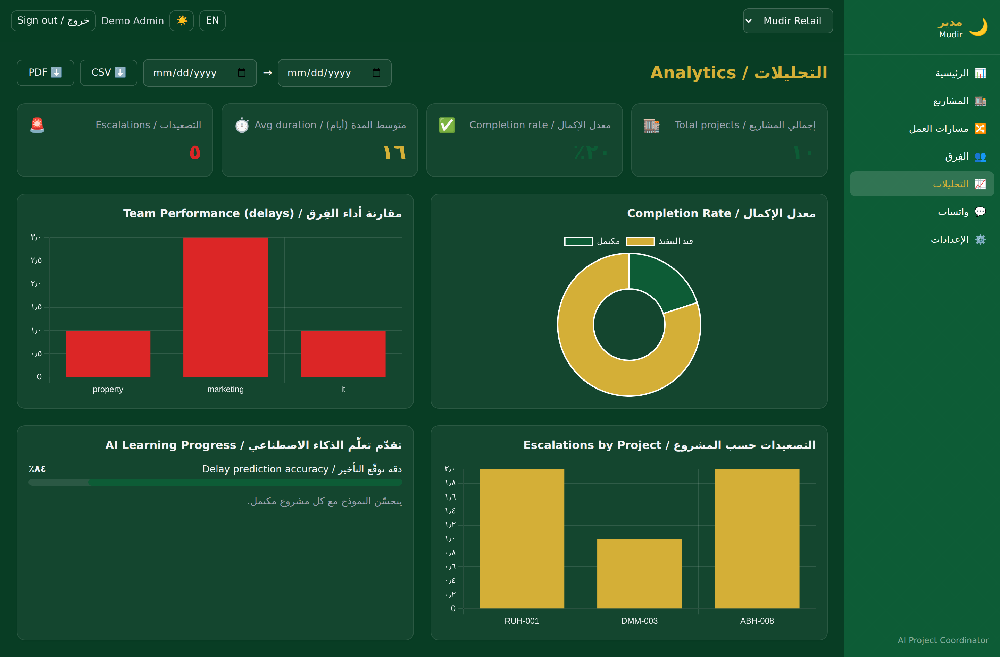 |

## Settings

AI model, working days, escalation rules, notification preferences, API key
status, system health and the log viewer.

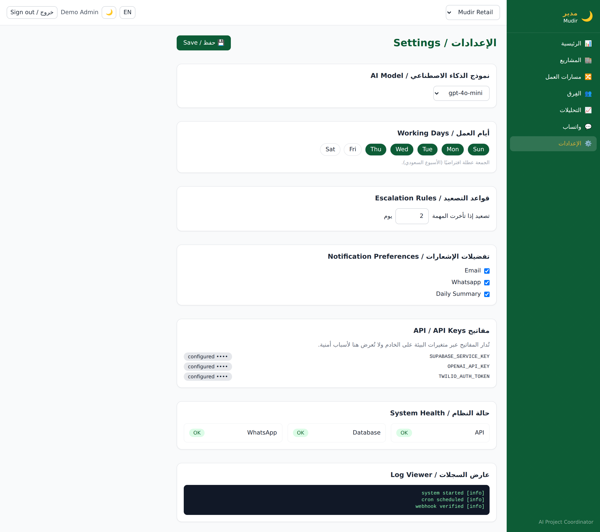

## WhatsApp settings

Provider/connection status, group management, template editor and a test
message sender.

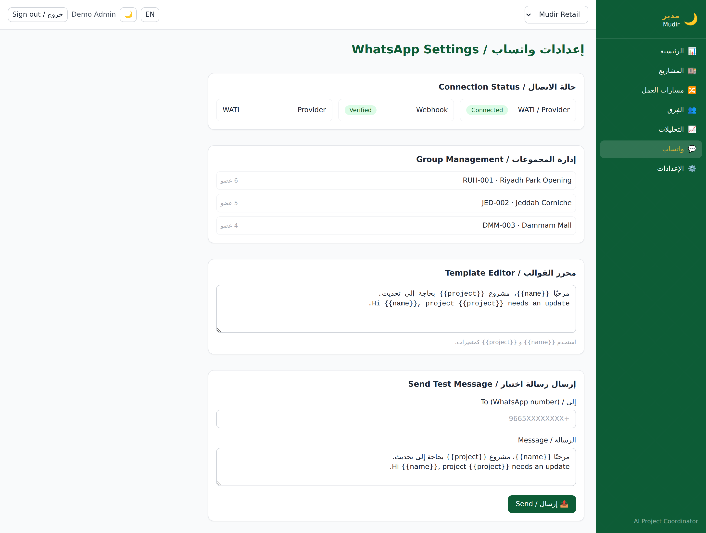
